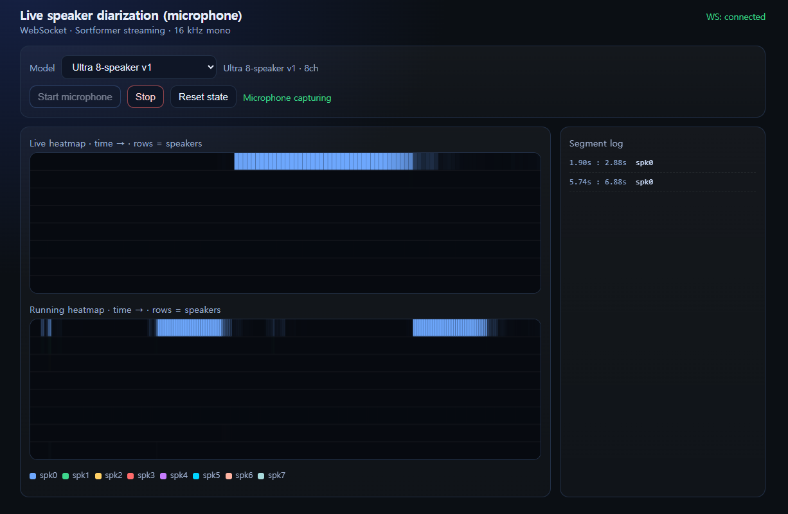

# diar_streaming_demo

Mic → WebSocket → NeMo Sortformer streaming diarization (browser UI).



## Setup

1. Install [PyTorch](https://pytorch.org/get-started/locally/) (CPU or CUDA) **before** NeMo.
2. `pip install -r requirements.txt`
3. `huggingface-cli login` (or `HF_TOKEN`) — models load from the Hub.

## Run

```bash
python server.py --device cpu --preset nvidia_4spk_v21
```

Open `http://localhost:8765/`. No GPU or CUDA errors → try `--device cpu`. Other options → `python server.py -h`.
